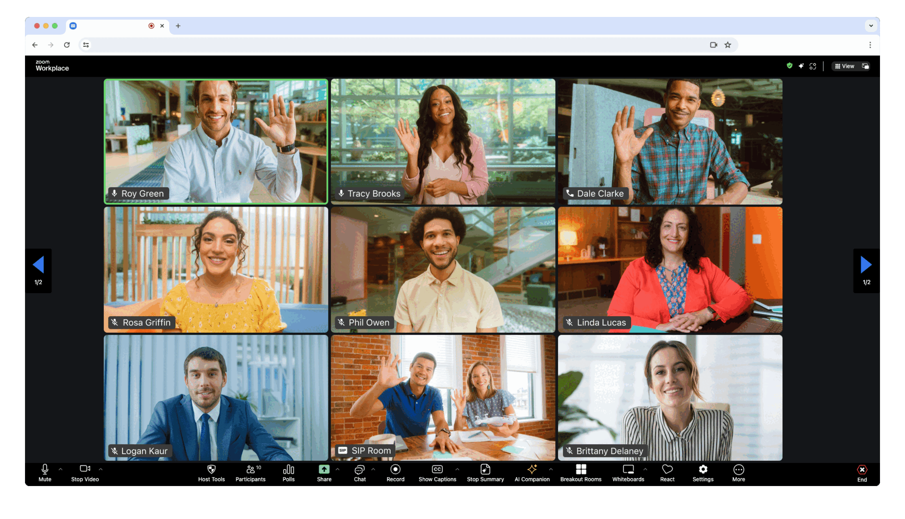

# AI-Powered Meeting Assistant

Use of this sample app is subject to our [Terms of Use](https://explore.zoom.us/en/legal/zoom-api-license-and-tou/).

This is a cutting-edge [React](https://reactjs.org/) application built with [Vite](https://vitejs.dev/) that showcases the power of AI in meetings. It features a **beautiful Apple-inspired landing page** and uses the [Zoom Meeting SDK](https://developers.zoom.us/docs/meeting-sdk/web/) combined with advanced AI capabilities to revolutionize meeting experiences.

## ✨ Features

### 🎨 Beautiful Landing Page
- **Apple-inspired design** with smooth animations and elegant typography
- **Interactive feature showcase** with live demos
- **Responsive design** that works on all devices
- **Modern UI components** with Tailwind CSS and Framer Motion

### 🤖 AI-Powered Meeting Features
- **AI Meeting Copilot** - Your intelligent meeting companion
- **Smart Screenshot Analysis** - OCR and content extraction with Google Gemini 2.0
- **Real-time Transcription** - Live speech-to-text with AI analysis
- **Post-Meeting Follow-up** - Automated email generation and action items
- **Document Intelligence** - AI analysis of meeting materials
- **Meeting Analytics** - Sentiment analysis and engagement metrics



## 🚀 Installation

To get started, clone the repo:

```bash
git clone https://github.com/zoom/meetingsdk-react-sample.git
cd meetingsdk-react-sample
```

## ⚙️ Setup

1. Install dependencies:
   ```bash
   npm install
   ```

2. Create a `.env` file in the root directory with your API keys:
   ```env
   VITE_ZOOM_MEETING_SDK_KEY=your_zoom_sdk_key
   VITE_ZOOM_MEETING_SDK_SECRET=your_zoom_sdk_secret
   VITE_OPENROUTER_API_KEY=your_openrouter_api_key
   ```

3. Configure your Zoom Meeting SDK credentials in the environment variables.

4. Start the development server:
   ```bash
   npm run dev
   ```

## 🎯 Usage

1. **Landing Page**: Navigate to http://localhost:5173 to see the beautiful landing page
2. **Start Meeting**: Click "Start AI Meeting" or "Launch Meeting App" to access the meeting interface
3. **AI Features**: Use the AI copilot to enhance your meeting experience with:
   - Smart screenshot capture and analysis
   - Real-time transcription and insights
   - Automated follow-up generation
   - Document analysis and recommendations

### Meeting SDK Configuration

| Variable | Description |
|----------|-------------|
| `VITE_ZOOM_MEETING_SDK_KEY` | Your Zoom Meeting SDK key |
| `VITE_ZOOM_MEETING_SDK_SECRET` | Your Zoom Meeting SDK secret |
| `VITE_OPENROUTER_API_KEY` | OpenRouter API key for AI features |

## 🛠️ Technology Stack

- **Frontend**: React 18 + TypeScript + Vite
- **Styling**: Tailwind CSS + Custom Apple-inspired design
- **Animations**: Framer Motion for smooth interactions
- **AI Integration**: Google Gemini 2.0 Flash via OpenRouter
- **Meeting SDK**: Zoom Meeting SDK for web
- **UI Components**: Radix UI + Custom components

## 🎨 Design Philosophy

The landing page follows Apple's design principles:
- **Simplicity**: Clean, uncluttered interface
- **Elegance**: Refined typography and spacing
- **Functionality**: Every element serves a purpose
- **Delight**: Smooth animations and interactions

## 📱 Responsive Design

The application is fully responsive and optimized for:
- **Desktop**: Full-featured experience with all animations
- **Tablet**: Adapted layout with touch-friendly interactions
- **Mobile**: Streamlined interface optimized for small screens

## 🚀 Deployment

### GitHub Pages

1. Configure the `vite.config.ts` with your repository name
2. Build the project: `npm run build`
3. Deploy to GitHub Pages using the `/docs` folder

### Other Platforms

The built application can be deployed to any static hosting service:
- Vercel
- Netlify
- AWS S3
- Azure Static Web Apps

## 🤝 Contributing

We welcome contributions! Please see [CONTRIBUTING.md](CONTRIBUTING.md) for guidelines.

## 📄 License

This project is licensed under the terms specified in [LICENSE.md](LICENSE.md).

## 🆘 Need Help?

- [Developer Support](https://devsupport.zoom.us)
- [Developer Forum](https://devforum.zoom.us)
- [Premier Developer Support](https://explore.zoom.us/docs/en-us/developer-support-plans.html)

---

**Built with ❤️ and cutting-edge AI technology**
